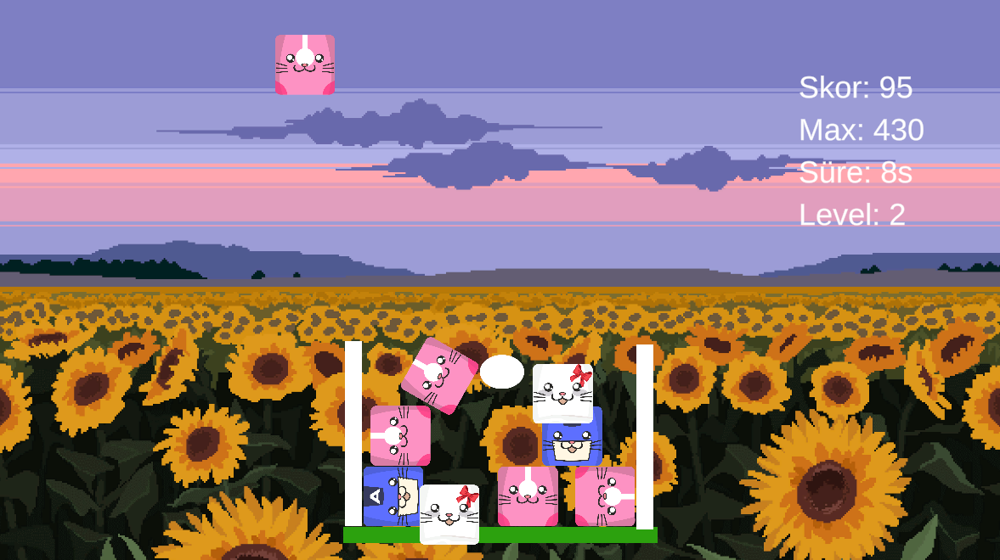

# 🎮 AnimalGame

Unity 6 ile yaptığım ilk proje — bir ders ödevi kapsamında hazırlandı. Unity'e ve C# ile oyun geliştirmeye ilk adımımı attığım, deneme amaçlı küçük bir çalışma.



---

## 🕹️ Proje Hakkında

Bir bilgisayar mühendisliği ödevi olarak geliştirilen hayvan temalı basit bir Unity projesi. Amaç bir "ürün" ortaya çıkarmaktan çok, Unity motorunu ve C# ile oyun mekaniği yazmayı tanımaktı. Proje şu an **aktif olarak geliştirilmiyor** — ödev kapsamında ulaşabildiğim noktada bırakıldı.

> Ekran görüntülerine `/screenshot` klasöründen ulaşabilirsin.

---

## 💡 Bu Projeden Öğrendiklerim

- Unity 6 arayüzü, komponent yapısı ve oyun döngüsü (Game Loop) temelleri
- C# ile script yazarak temel oyun mantığı kurma
- Git ve GitHub ile proje/sürüm yönetimine ilk adım

---

## 🚀 Teknolojiler

| | |
|---|---|
| **Oyun Motoru** | Unity 6 |
| **Dil** | C# |

---

## 🛠️ Projeyi Açmak İçin

1. Repoyu klonla:
   ```bash
   git clone https://github.com/anilaglarin/AnimalGames.git
   ```
2. **Unity Hub** üzerinden projeyi aç (Unity 6 sürümü kurulu olmalı).
3. `Assets/SampleScene` sahnesini aç ve ▶️ **Play** ile test et.

---

## 📅 Ödev Kapsamında İzlediğim Yol Haritası

Ödevi ilerletirken kendime çizdiğim fazlar ve nereye kadar gidebildiğim:

- [x] **Faz 1: İlk Adım & Temeller**
  - [x] Unity projesinin oluşturulması ve `.gitignore` ile temiz bir Git yapısı kurulması
  - [x] Proje klasör hiyerarşisinin düzenlenmesi
  - [x] Ana sahnenin (SampleScene) ilk ayarlarının yapılması

- [x] **Faz 2: Mekanikler & Karakterler**
  - [x] Sahneye ilk hayvan/karakter modellerinin dahil edilmesi
  - [x] Temel dokunmatik (touch) kontrol scriptlerinin yazılması
  - [x] Çarpışma (Collision) ve tetiklenme (Trigger) testleri

- [x] **Faz 3: Oyun Döngüsü & Arayüz (UI)**
  - [x] Skor tutma ve yüksek skor kaydetme sistemi
  - [x] Ana menü, oyun içi HUD ve "Oyun Bitti" panelleri
  - [x] Temel ses efektleri ve müzik

- [ ] **Faz 4: Test ve Dağıtım**
  - [ ] Performans testleri
  - [ ] Paketleme / dışa aktarma

Ödev, Faz 3'e kadar olan kısımlar tamamlanarak teslim edildi. Faz 4 (test ve dağıtım) yapılmadı — proje istenirse ileride daha da geliştirilebilir.

---

## 📄 Not

Bu proje bir okul ödevi olarak hazırlanmıştır, ticari veya yayınlanmış bir ürün değildir.
